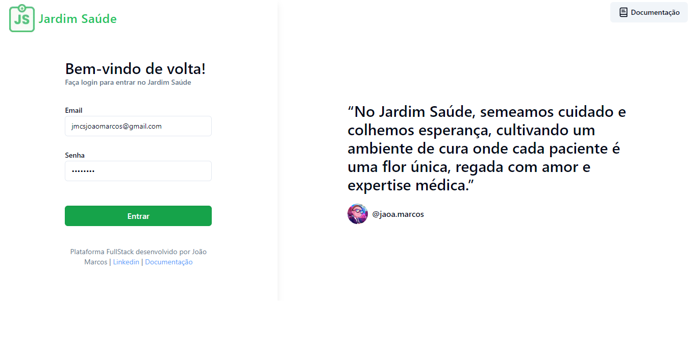
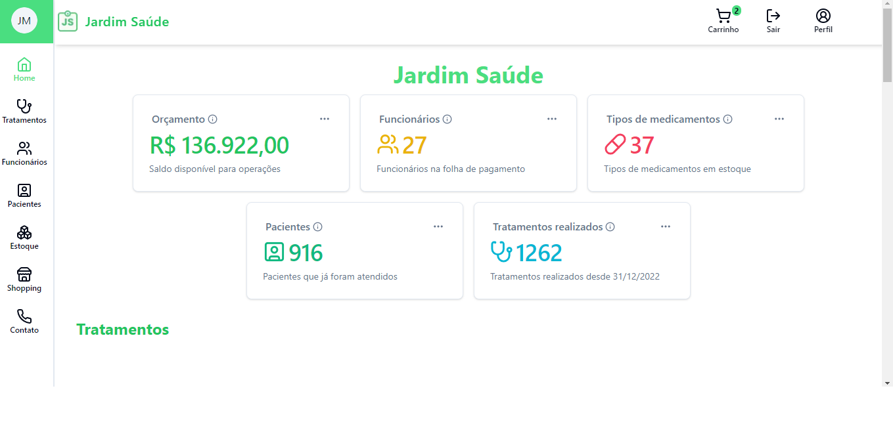
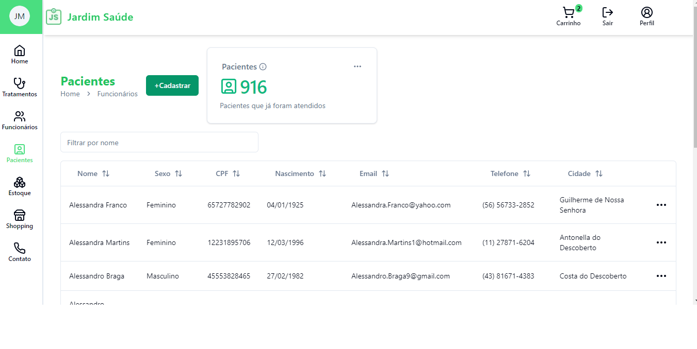
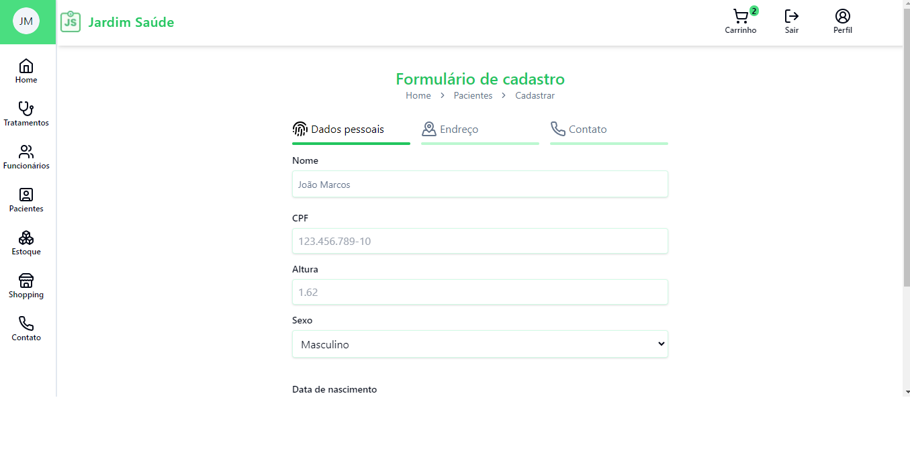
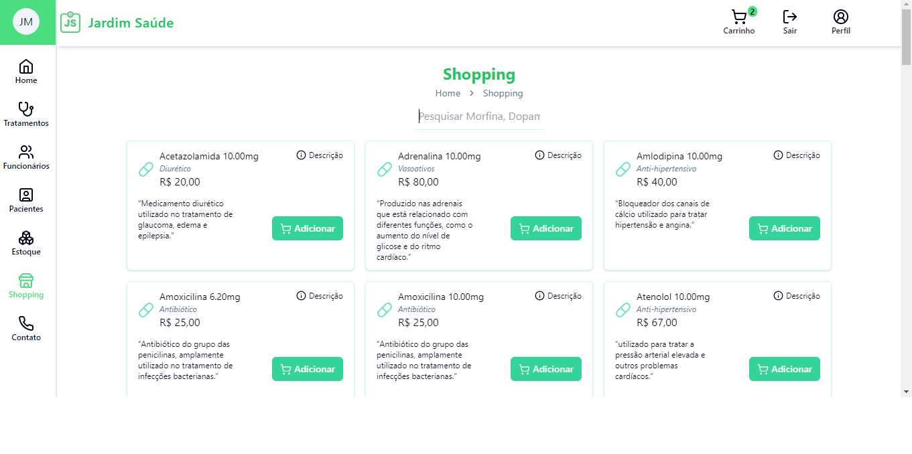
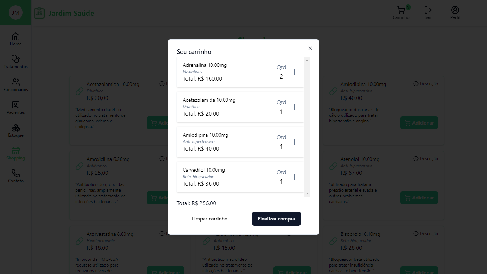
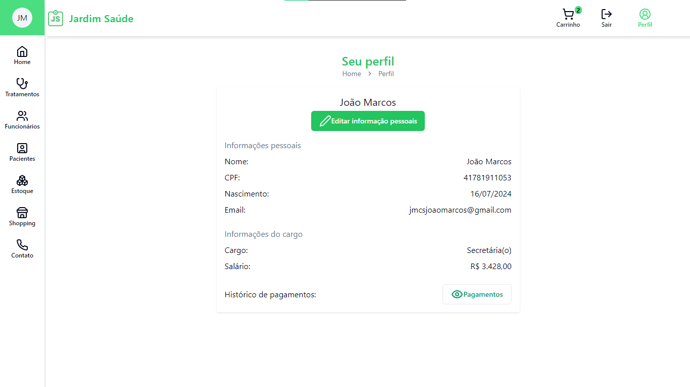

[TYPESCRIPT__BADGE]: https://img.shields.io/badge/typescript-D4FAFF?style=for-the-badge&logo=typescript
[JSONWEBTOKEN_BADGE]:https://img.shields.io/badge/JWT-black?style=for-the-badge&logo=JSON%20web%20tokens
[ZOD_BADGE]:https://img.shields.io/badge/zod-%233068b7.svg?style=for-the-badge&logo=zod&logoColor=white
[VERCEL_BADGE]:https://img.shields.io/badge/vercel-%23000000.svg?style=for-the-badge&logo=vercel&logoColor=white
[NEXTJS_BADGE]:https://img.shields.io/badge/Next-black?style=for-the-badge&logo=next.js&logoColor=white
[REACT_HOOK_FORM_BADGE]:https://img.shields.io/badge/React%20Hook%20Form-%23EC5990.svg?style=for-the-badge&logo=reacthookform&logoColor=white
[REDUX_TOOLKIT_BADGE]:https://img.shields.io/badge/redux-%23593d88.svg?style=for-the-badge&logo=redux&logoColor=white
[REACT_QUERY_BADGE]:https://img.shields.io/badge/-React%20Query-FF4154?style=for-the-badge&logo=react%20query&logoColor=white
[TAILWIND_BADGE]:https://img.shields.io/badge/tailwindcss-%2338B2AC.svg?style=for-the-badge&logo=tailwind-css&logoColor=white

<h1 align="center" style="font-weight: bold;">Jardim Saúde</h1>

![NextJS][NEXTJS_BADGE]
![Typescript][TYPESCRIPT__BADGE]
![Tailwind][TAILWIND_BADGE]
![Jwt][JSONWEBTOKEN_BADGE]
![Redux][REDUX_TOOLKIT_BADGE]
![React Hook Form][REACT_HOOK_FORM_BADGE]
![React_query][REACT_QUERY_BADGE]
![Zod][ZOD_BADGE]
![Vercel][VERCEL_BADGE]

 <a href="#about">Sobre Jardim Saúde</a> •
  <a href="#frontend">Sobre o Frontend</a> •
  <a href="#screens">Telas</a> •
 

<h2 id="about">📖 Sobre o Jardim Saúde</h2>
O projeto Jardim Saúde é um MVP de uma clínica de saúde com dois tipos de usuários
com diferentes níveis de acesso(
     <a href="https://jardim-saude-doc.vercel.app/#secretarias">secretária</a>
     e
    <a href="https://jardim-saude-doc.vercel.app/#medicos">médico</a>
    ). Clique e veja a documentação das features do <a href="https://jardim-saude-doc.vercel.app/">Jardim Saúde</a>. Eu desenvolvi esse MVP com o objetivo de consolidar meus conhecimentos nos ambientes de frontend e backend.

<h2 id="frontend">🖌️ Sobre o frontend do Jardim Saúde</h2>
O frontend foi construido usando arquitetura package by feature e tecnologias como NextJS, Redux para gerenciamento de estado, React Hook Form
para criação de formulários e React Query para gerenciar os requests para a API. Embora o NextJS
já possua cacheamento, server functions e streaming, eu optei por usar o React Query para poder conhecer
essa biblioteca tão famosa e entender como ela funciona, logo, todas as funcionalidades ligadas aos requests da aplicação são feitas pelo React Query. Outro ponto importante são os formulários, nem todos estão em seu potencial máximo, apenas o formulário de cadastro de pacientes, pois quando esta feature foi implementada eu já tinha melhor entendimento em como trabalhar com o Hook Form e como utiliza-lo de forma mais complexa com validações personalizadas com refine e transform. Além disso, nem todos os inputs possuem máscaras de formatação. Para mais informações, acesse a <a  href="https://jardim-saude-doc.vercel.app/">documentação</a> do Jardim Saúde. A seguir, veja algumas telas do sistema.

<h1 id="screens">🖥️ Telas</h1>

<h2>Tela de Login</h2>

<h2>Tela Home</h2>

<h2>Tela de Pacientes</h2>

<h2>Tela de Cadastro de Pacientes</h2>

<h2>Tela do Shopping</h2>

<h2>Tela do Carrinho</h2>

  <b>Uma melhoria sobre a feature de carrinho seria implementar uma tabela no backend que representa o carrihno do usuário, pois, até o momento, o estado do carrinho do usuário é mantido no LocalStorage, com isso, o usuário não consegue acessar seu carrinho caso esteja em outra máquina.</b>

<h2>Tela do Perfil</h2>

<h2>✔️ O que aprendi</h2>
Durante todo o processo de desenvolvimento do Jardim Saúde eu aprendi muito sobre os ambientes de front e backend, mas além disso, aprendi sobre como deve ser o desenvolvimento de software, sobre a importância de deixar os arquivos padronizados, os commits claros e diretos, pois muitas vezes eu me perdia nas funções e no que ainda tinha que ser alterado, o que também ratificou a necessidade de usar uma métodologia agil(Scrum) para organização, através de uma plataforma de gerenciamento como ClickUp, Trello ou Jira. Após esse projeto, embora pequeno com apenas 9 entidades, me sinto muito mais confiante e consigo compreender claramente como funciona a comunicação entre o front e o backend. Como está na documentação do projeto, na seção "próximas melhorias", ainda são necessários vários outros conhecimentos para me tornar um bom desenvolvedor, como docker e swagger, que são tecnologias e ferramentas indispensáveis no dia a dia de times de desenvolvedores.

<h2 id="colab">🤝 Colaboradores</h2>

<table>
  <tr>
    <td align="center">
      <a href="#">
         
        
          <b>João Marcos</b>
        
      </a>
    </td>
  </tr>
</table>
